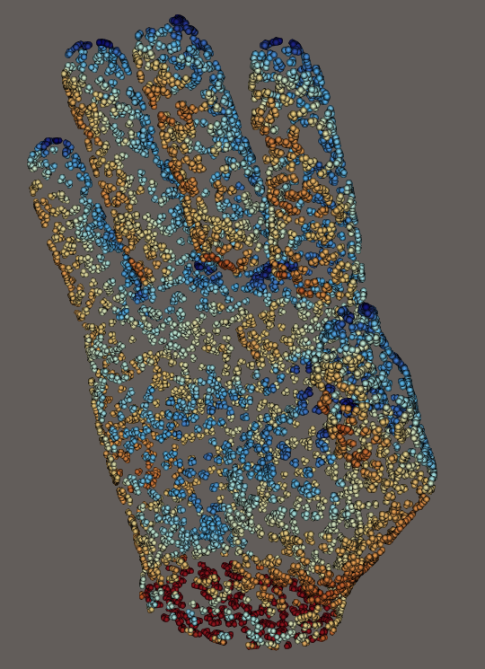
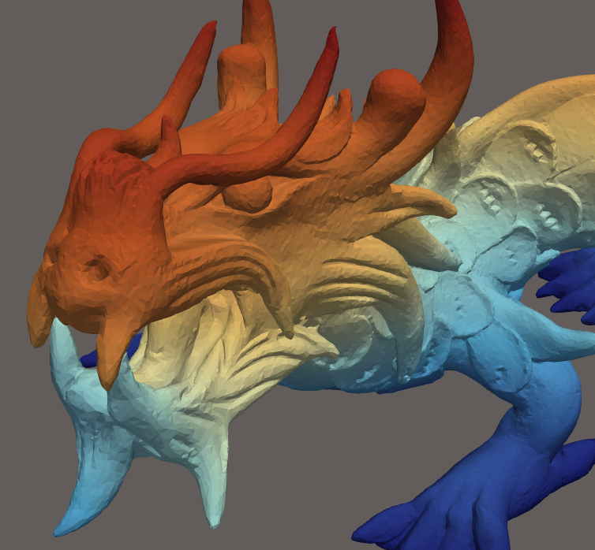

<!-- README.md is generated from README.Rmd. Please edit that file -->

# vespa — VTK Enhanced with Surface Processing Algorithms

<!-- badges: start -->

[](https://lifecycle.r-lib.org/articles/stages.html#experimental)
[](https://CRAN.R-project.org/package=vespa)
<!-- badges: end -->

**vespa** is an R package providing bindings to the
[VESPA](https://gitlab.kitware.com/vtk-cgal/vespa) C++/VTK/CGAL mesh
processing library. It exposes CGAL geometry and surface processing
algorithms as R functions operating on `mesh3d` objects (package
[rgl](https://cran.r-project.org/package=rgl)).


*Isotropic remeshing of a surface mesh*

``` r
library(vespa)
mesh   <- read_stl(system.file("extdata", "torus.stl", package = "vespa"))
remesh <- isotropic_remeshing(mesh, target_length = 0.1, n_iterations = 3L)
rgl::shade3d(remesh, col = "steelblue")
```




*Surface reconstruction from a point cloud (input cloud / reconstructed
mesh)*

``` r
library(vespa)
pts   <- read_points_xyz(system.file("testdata", "test_points.xyz",
                                     package = "vespa"))
pts   <- pca_estimate_normals(pts, n_neighbors = 18L, orient = TRUE)
recon <- poisson_reconstruction(pts)
rgl::shade3d(recon, col = "tomato")
```




*As-Rigid-As-Possible mesh deformation (original / deformed)*

``` r
library(vespa)
mesh <- read_stl(system.file("extdata", "torus.stl", package = "vespa"))

n        <- ncol(mesh$vb)
fixed    <- which(mesh$vb[3, ] < -0.25)          # bottom ring — fixed handles
moved    <- which(mesh$vb[3, ] >  0.25)           # top ring    — pulled up
target   <- mesh$vb[1:3, moved, drop = FALSE]
target[3, ] <- target[3, ] + 0.4                  # translate +0.4 along Z

deformed <- mesh_deformation(mesh,
                             control_ids   = c(fixed, moved),
                             target_coords = cbind(mesh$vb[1:3, fixed], target),
                             roi_ids       = seq_len(n))
rgl::shade3d(deformed, col = "goldenrod")
```

## Installation

``` r
# install.packages("pak")
pak::pak("cregouby/vespa")
```

The package requires VTK \>= 9.0 and CGAL \>= 5.3. Run the `configure`
script once before building so that `src/Makevars` is generated:

``` sh
./configure
```

Override auto-detected paths if needed:

``` sh
VESPA_DIR=/usr/local/bin/vespa \
VTK_DIR=/usr/local/lib/cmake/vtk-9.5 \
CGAL_INC=/opt/homebrew/include \
./configure
```

## Usage notes

All filters expect a triangulated, watertight, 2-manifold surface
represented as a `mesh3d` object. Use `mesh_check()` to diagnose
topological issues and `alpha_wrapping()` to repair a mesh that is not
watertight or 2-manifold.

## License

This package is distributed under a BSD-3 license. Because it links to
CGAL, any binary built from it retains the GPLv3 license unless you hold
a commercial license from
[GeometryFactory](https://geometryfactory.com/).
