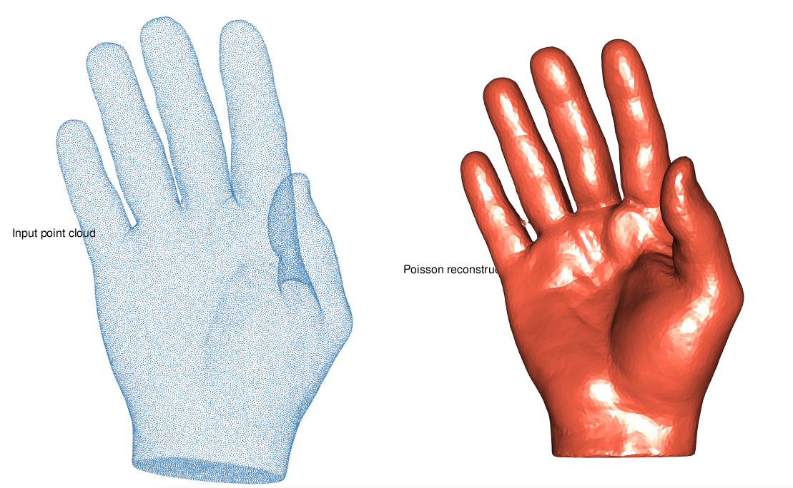

# Poisson Surface Reconstruction

Poisson surface reconstruction retrieves a closed, watertight surface
mesh from a point cloud equipped with oriented normals.

It operates in an [implicit
space](https://en.wikipedia.org/wiki/Implicit_surface): it solves a
Poisson equation for the indicator function whose gradient best matches
the input normals, then extracts the zero level-set as a triangle mesh.

``` r

library(vespa)
hand_url <- "https://gitlab.kitware.com/vtk/meshing/vespa/-/raw/master/Data/Testing/hand.vtp?ref_type=heads"
hand_tmp <- tempfile(fileext = ".vtp")
download.file(hand_url, hand_tmp, quiet = TRUE)
```

## Preparation

The demo uses `hand.vtp` from the VESPA test suite — a dense
triangulated surface mesh of a human hand (61 082 vertices, 122 160
triangles). We deliberately discard the face connectivity and retain
only the vertex positions, turning the mesh into a raw, unstructured
point cloud. This lets us run the full reconstruction pipeline: normal
estimation with PCA, then Poisson reconstruction. The original mesh will
serve as ground-truth for the visual comparison at the end.

``` r

hand_mesh <- read_vtp(hand_tmp)
print(hand_mesh)
#> <mesh3d> 61082 vertices 122160 faces
```

We then strip the face connectivity to obtain a raw, unstructured point
cloud:

``` r

hand_pts <- hand_mesh
hand_pts$it <- matrix(integer(0), 3L, 0L)
```

## Normal estimation

[`poisson_reconstruction()`](https://cregouby.github.io/vespa/reference/poisson_reconstruction.md)
requires oriented normals. If your point cloud has none (as is the case
here, since we stripped the mesh connectivity and with it any per-vertex
normal information), use
[`pca_estimate_normals()`](https://cregouby.github.io/vespa/reference/pca_estimate_normals.md):
it fits a local plane to the `n_neighbors` nearest neighbours and
derives a normal from that plane.

Setting `orient = TRUE` propagates a consistent orientation across the
cloud via a minimum spanning tree on the normal graph.

``` r

hand_pts <- pca_estimate_normals(hand_pts, n_neighbors = 18L, orient = TRUE)
```

## Poisson reconstruction

The three key parameters control the density and quality of the output
mesh:

| Parameter | Role |
|----|----|
| `min_angle` | Minimum triangle angle (degrees). Higher values give more regular triangles but may increase face count. |
| `max_size` | Maximum triangle edge length relative to the local point spacing. Lower values produce finer meshes. |
| `distance` | Maximum Hausdorff distance between the output mesh and the implicit surface. Smaller values follow the surface more faithfully. |

``` r

hand_recon <- poisson_reconstruction(
  hand_pts,
  min_angle = 20,
  max_size  = 2,
  distance  = 0.375
)
print(hand_recon)
#> <mesh3d> 72970 vertices 23772 faces
```

## Comparison

``` r

summary(hand_mesh)
#> 
#> ── mesh3d
#> Vertices: 61082
#> Faces: 122160
#> X range: [-0.96596, 0.89204]
#> Y range: [-0.64539, 0.70538]
#> Z range: [-0.51493, 0.34991]
#> Diagonal: 2.4545
#> Normals: no
#> 
summary(hand_recon)
#> 
#> ── mesh3d
#> Vertices: 72970
#> Faces: 23772
#> X range: [-0.96596, 0.89204]
#> Y range: [-0.64539, 0.70538]
#> Z range: [-0.51493, 0.34991]
#> Diagonal: 2.4545
#> Normals: no
```

The Poisson method tends to produce a smooth, slightly blurred
reconstruction because the implicit solve acts as a low-pass filter.
Tightening `distance` and `max_size` recovers finer surface details at
the cost of a higher face count.

``` r

rgl::mfrow3d(1, 2)
rgl::points3d(t(hand_pts$vb[1:3, ]), size = 1, col = "steelblue")
rgl::title3d("Input point cloud")
rgl::next3d()
rgl::shade3d(hand_recon, col = "tomato")
rgl::title3d("Poisson reconstruction")
```


