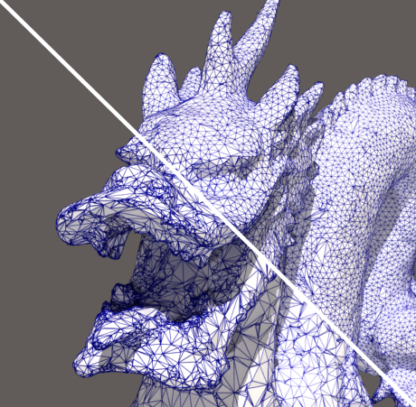
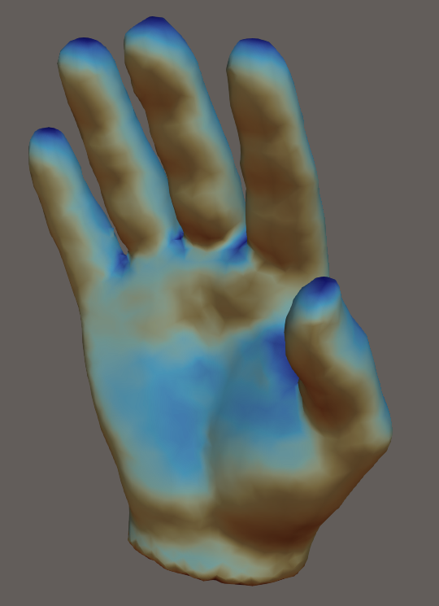
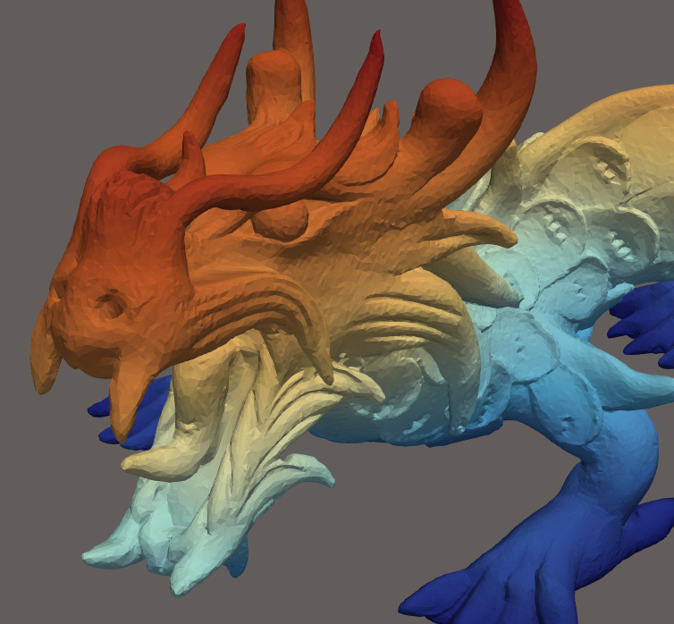

# vespa — VTK Enhanced with Surface Processing Algorithms

**vespa** is an R package providing bindings to the
[VESPA](https://gitlab.kitware.com/vtk-cgal/vespa) C++/VTK/CGAL mesh
processing library. It exposes CGAL geometry and surface processing
algorithms as R functions operating on `mesh3d` objects (package
[rgl](https://cran.r-project.org/package=rgl)).



*Isotropic remeshing of a surface mesh*

``` r

library(vespa)
mesh   <- read_stl(system.file("extdata", "torus.stl", package = "vespa"))
remesh <- isotropic_remeshing(mesh, target_length = 0.1, n_iterations = 3L)
rgl::shade3d(remesh, col = "steelblue")
```



*Surface reconstruction from a point cloud (input cloud / reconstructed
mesh)*

``` r

library(vespa)
pts   <- read_points_xyz(system.file("testdata", "test_points.xyz",
                                     package = "vespa"))
pts   <- pca_estimate_normals(pts, n_neighbors = 18L, orient = TRUE)
recon <- poisson_reconstruction(pts)
rgl::shade3d(recon, col = "tomato")
```



*As-Rigid-As-Possible mesh deformation (original / deformed)*

``` r

library(vespa)
mesh <- read_stl(system.file("extdata", "torus.stl", package = "vespa"))

n        <- ncol(mesh$vb)
fixed    <- which(mesh$vb[3, ] < -0.25)          # bottom ring — fixed handles
moved    <- which(mesh$vb[3, ] >  0.25)           # top ring    — pulled up
target   <- mesh$vb[1:3, moved, drop = FALSE]
target[3, ] <- target[3, ] + 0.4                  # translate +0.4 along Z

deformed <- mesh_deformation(mesh,
                             control_ids   = c(fixed, moved),
                             target_coords = cbind(mesh$vb[1:3, fixed], target),
                             roi_ids       = seq_len(n))
rgl::shade3d(deformed, col = "goldenrod")
```

## Installation

### Prerequisites

The VESPA C++ library requires VTK \>= 9.0 and CGAL \>= 5.3. and Ceres.
You must install them with your software package manager.

### C++ package installation

Installation of VESPA C++ library shall follow [Vespa Installation
Documentation](https://gitlab.kitware.com/vtk/meshing/vespa#vespa). We
will rely on VESPA being installed in the path `CMAKE_INSTALL_PREFIX`
environemnt variable

### R package installation

As soon as VESPA installation path is in the environemnt variable
`CMAKE_INSTALL_PREFIX`, then we can provide it to the installation
script :

``` r

# install.packages("remotes")
remotes::install.github("cregouby/vespa", configure.vars = "VESPA_ROOT=$CMAKE_INSTALL_PREFIX")
```

or from a terminal

``` shell
cd vespa
export VESPA_ROOT=$CMAKE_INSTALL_PREFIX
R CMD INSTALL .
```

### R package installation step by step (development)

Run the `configure` script once before building so that `src/Makevars`
is generated:

``` sh
./configure
```

Override auto-detected paths if needed:

``` sh
VESPA_DIR=/usr/local/bin/vespa \
VTK_DIR=/usr/local/lib/cmake/vtk-9.5 \
CGAL_INC=/opt/homebrew/include \
./configure
```

## Usage notes

All filters expect a triangulated, watertight, 2-manifold surface
represented as a `mesh3d` object. Use
[`mesh_check()`](https://cregouby.github.io/vespa/reference/mesh_check.md)
to diagnose topological issues and
[`alpha_wrapping()`](https://cregouby.github.io/vespa/reference/alpha_wrapping.md)
to repair a mesh that is not watertight or 2-manifold.

## License

This package is distributed under a BSD-3 license. Because it links to
CGAL, any binary built from it retains the GPLv3 license unless you hold
a commercial license from
[GeometryFactory](https://geometryfactory.com/).
