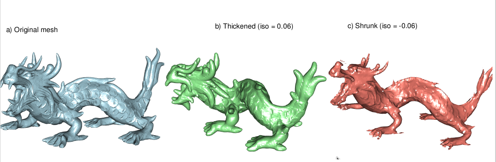

```{r, include = FALSE}
knitr::opts_chunk$set(
  collapse = TRUE,
  comment = "#>"
)
```

```{r}
#| label: setup
library(vespa)

library(rgl)
dragon_url <- "https://gitlab.kitware.com/vtk/meshing/vespa/-/raw/master/Data/Testing/dragon.vtp"
dragon_tmp <- tempfile(fileext = ".vtp")
download.file(dragon_url, dragon_tmp, quiet = TRUE)
```

Speaking of implicit surface, the Signed Distance Function transforms a close-meshed shape into an volume with each voxel being the distance to the mesh surface.

The distance is positive outside of the mesh, and negative inside the mesh.

This creates an implicit surface, defined by all the voxels being 0. In VTK terms, you can transform a PolyData into an ImageData.

Here, many operations or visualizations are simpler like convoluting your shape with a kernel, having a volumetric render of your object, resampling, etc. You can then reconstruct a mesh using the Contour filter. Choosing an isosurface value different from 0 allows you to grow or shrink the original mesh.

The memory footprint is $O(n^3)$ with n being the `base_resolution`. The `base_resolution` value is used for the smallest dimension of the mesh, the other dimensions resolution are derived as each the voxel is cubical.

```{r}
#| label: "compute sdf"
#| echo: TRUE
# a) Original mesh
dragon <- read_vtp(dragon_tmp)

# Build the SDF volume — result is now an `sdf_volume` object
tictoc::tic()
dragon_sdf <- signed_distance_function(dragon, base_resolution = 64L, padding = 3L)
tictoc::toc()
dragon_sdf
```

After the heavy computation of the SDF for 1M points, every transformation is trivial

```{r}
#| label: "shrink and thick"
# Isovalues expressed in physical units (voxel size)
iso_thicken <-  1 * dragon_sdf$spacing[1]   # outside -> grows
iso_shrink  <- -1 * dragon_sdf$spacing[1]   # inside  -> shrinks

# b) Thickened mesh
dragon_thick <- extract_isosurface(dragon_sdf, isovalue = iso_thicken)

# c) Shrunk mesh
dragon_shrunk <- extract_isosurface(dragon_sdf, isovalue = iso_shrink)
```

Now it is time to see the result :

```{r}
#| label: "3D visualization"
#| eval: false
#| fig.show: 'hold'
#| fig.cap: "a) Initial mesh; b) Shape thickening (isovalue > 0); c) Shape shrinking (isovalue < 0)"
#| out.width: '33%'
mfrow3d(1, 3)
shade3d(dragon, color = "lightblue")
title3d(main = "a) Original mesh")
rgl::next3d()
shade3d(dragon_thick, color = "lightgreen")
title3d(main = sprintf("b) Thickened (iso = %.2f)", iso_thicken))
rgl::next3d()
shade3d(dragon_shrunk, color = "salmon")
title3d(main = sprintf("c) Shrunk (iso = %.2f)", iso_shrink))
```


